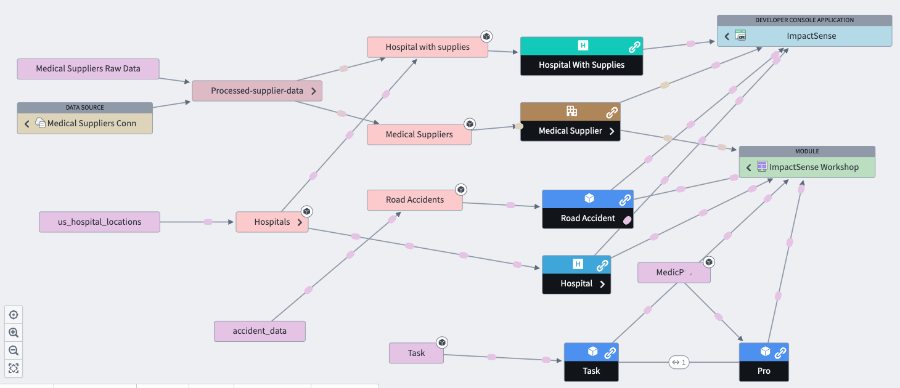
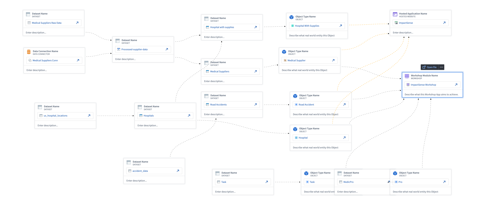

# impactSense-app

This project was generated with [`@osdk/create-app`](https://www.npmjs.com/package/@osdk/create-app) and demonstrates using the Ontology SDK package `@impactsense/sdk` with React on top of Next.js. Check out the [Next.js](https://nextjs.org/docs) docs for further configuration.

## Description
This project constitutes as an AI agent for hospitals that answers users questions. 
The application is able to determine the closest hospital to a given accident by using Haversine function.
The web application displays information, such as the address, number of beds availables, the distance between the road accident and the hospital.
The project uses Langchain as an AI agent framework and NextJS as a React framework along side Redux as a Javascript library.

## Installation
To install the application first execute
```sh
npm run install
```
Followed by 
```sh
npm run dev
```

## Configuration steps
1. The project uses langchain as a framework and therefore requires OPENAI API KEY which should be store in the environment variables. You can create your own key following instructions here : `https://platform.openai.com/docs/quickstart`


## Usage Examples
1. The user must select an accident object
2. The user clics on the button to determine the closest hospital
3. Once the hospital fetched, the user writes a prompts as a question.

## Screenshots
1. Linear Graph


2. Solution Designer


## Requirements
1. The application is built on NextJS as a React framework and it uses Node18. You can download Node here: `https://nodejs.org/en/download`:
2. There are multiple packages required for the web appication to work properly. Execute the following commands:
```sh
npm install @mui/material
npm install @emotion/styled
npm install dotenv
npm install redux
npm install @reduxjs/toolkit
```
3. An OPENAI API KEY

## Developing

Run the following command or equivalent with your preferred package manager to start a local development server on `http://localhost:8080`:

```sh
npm run dev
```

Development configuration is stored in `.env.development`.

In order to make API requests to Foundry, CORS must be configured for the stack to allow `http://localhost:8080` to load resources. If this has not been configured and you are unable to request this, you can alternatively generate your project again with `--corsProxy true` to use a proxy for API requests during local development. The configured OAuth client must also allow `http://localhost:8080/auth/callback` as a redirect URL.

## Deploying

Run the following command or equivalent with your preferred package manager to create a production build of your application:

```sh
npm run build
```

Production configuration is stored in `.env.production`.

If you did not fill in the URL your production application will be hosted on you will need to fill in the `NEXT_PUBLIC_FOUNDRY_REDIRECT_URL` in `.env.production`. A default test is included in `env.test.ts` to verify your production environment variables which you can enable by removing the skip condition or running tests with the environment variable set `VERIFY_ENV_PRODUCTION=true`.

In order to make API requests to Foundry, CORS must be configured for the stack to allow the production origin to load resources. This will be automatically done for you if you are using Foundry website hosting. The configured OAuth client must also allow the production origin auth callback as a redirect URL.

A `foundry.config.json` file is included in the root of this project to make deploying to Foundry website hosting with [`@osdk/cli`](https://www.npmjs.com/package/@osdk/cli) easier. If you are not using Foundry website hosting for your application you may delete this file.

### Content Security Policy (CSP)

⚠️ Building this Next.js application will produce .html files that will require `'unsafe-inline'` in the `script-src` directive of your Content Security Policy. See https://github.com/vercel/next.js/discussions/54152 for more info.
